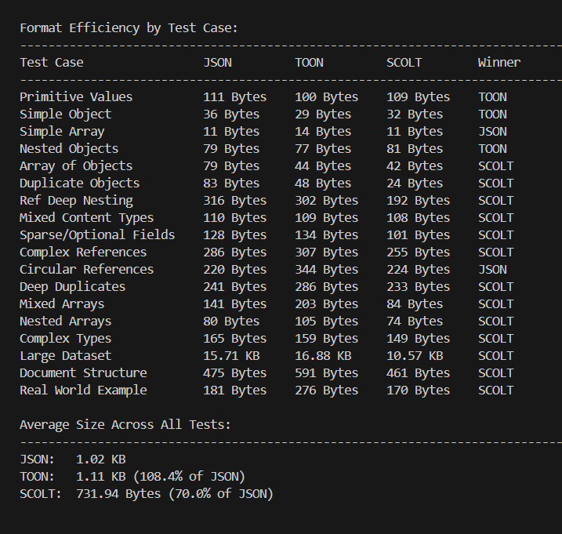

# SCOLT


**C**ompact **O**bject **L**ayout with **T**abular **S**erialization

A JavaScript library that converts nested JSON structures into a compact columnar table format. SCOLT dramatically reduces data size by identifying and reusing duplicate objects across your data structures.

## Why SCOLT?

JSON is readable but inefficient for storing repetitive data. SCOLT solves this by:

1. **Automatic deduplication** - Identical objects are stored once and referenced everywhere else
2. **Columnar storage** - Arrays of objects become compact tables
3. **Smart referencing** - Complex nested structures are flattened and cross-referenced

### When to Use SCOLT

SCOLT works best when your data has:
- Repeated object structures
- Arrays of similar objects
- Nested relationships with duplication
- Large datasets with patterns

For simple, small JSON objects, the overhead of SCOLT structure may not provide benefits.

## How It Works


SCOLT analyzes your JSON structure and:
1. Identifies arrays of objects and converts them to tables
2. Detects duplicate objects and stores them once
3. Creates references between related data
4. Outputs a compact text format

## Installation

```bash
npm install scolt
```

## Quick Start

```javascript
import { SCOLT } from 'scolt';

const data = {
  users: [
    { id: 1, name: "John" },
    { id: 2, name: "Jane" },
    { id: 3, name: "Bob" }
  ]
};

const scolt = new SCOLT();
const result = scolt.parse(data);
console.log(result);
```

Output:
```
#users{id,name}:
  1,John
  2,Jane
  3,Bob
```

## Examples

### Primitive Values

**Input:**
```javascript
{
  string: "Hello World",
  number: 42,
  boolean: true,
  nullValue: null,
  float: 3.14159,
  negative: -123,
  empty: ""
}
```

**SCOLT Output:**
```
#string: "Hello World"
#number: 42
#boolean: true
#nullValue: null
#float: 3.14159
#negative: -123
#empty: ""
```

### Simple Object

**Input:**
```javascript
{
  id: 1,
  name: "Test",
  active: true
}
```

**SCOLT Output:**
```
#id: 1
#name: Test
#active: true
```

### Simple Array

**Input:**
```javascript
[1, 2, 3, 4, 5]
```

**SCOLT Output:**
```
[1,2,3,4,5]
```

### Nested Objects

**Input:**
```javascript
{
  user: {
    id: 1,
    name: "John",
    profile: {
      age: 30,
      email: "john@example.com"
    }
  }
}
```

**SCOLT Output:**
```
@profile{age,email}: 30,john@example.com
#user{id,name,profile}: 1,John,@profile
```

### Array of Objects

**Input:**
```javascript
{
  users: [
    { id: 1, name: "John" },
    { id: 2, name: "Jane" },
    { id: 3, name: "Bob" }
  ]
}
```

**SCOLT Output:**
```
#users{id,name}:
  1,John
  2,Jane
  3,Bob
```

### Duplicate Objects

**Input:**
```javascript
{
  users: [
    { id: 1, role: "admin" },
    { id: 1, role: "admin" },
    { id: 1, role: "admin" }
  ]
}
```

**SCOLT Output:**
```
#users{id,role}: 1,admin
```

Notice how three identical objects become a single row. This is where SCOLT shines.

### Deep Nesting with References

**Input:**
```javascript
{
  teams: [
    {
      id: 1,
      name: "Team A",
      lead: { id: 1, name: "John", role: "lead" },
      members: [
        { id: 2, name: "Jane", role: "dev" },
        { id: 3, name: "Bob", role: "dev" }
      ]
    },
    {
      id: 2,
      name: "Team B",
      lead: { id: 4, name: "Alice", role: "lead" },
      members: [
        { id: 2, name: "Jane", role: "dev" },
        { id: 3, name: "Bob", role: "dev" }
      ]
    }
  ]
}
```

**SCOLT Output:**
```
@lead{id,name,role}:
  1,John,lead
  4,Alice,lead
@members{id,name,role}:
  2,Jane,dev
  3,Bob,dev
#teams{id,name,lead,members}:
  1,"Team A",@lead[0],@members
  2,"Team B",@lead[1],@members
```

Both teams share the same members array, stored once and referenced twice.

### Mixed Content Types

**Input:**
```javascript
{
  id: 1,
  meta: {
    tags: ["important", "featured"],
    counts: { views: 100, likes: 50 },
    active: true,
    ratio: 0.75
  }
}
```

**SCOLT Output:**
```
@counts{likes,views}: 50,100
#id: 1
#meta{active,counts,ratio,tags}: true,@counts,0.75,[important,featured]
```

### Sparse/Optional Fields

**Input:**
```javascript
{
  users: [
    { id: 1, name: "John", email: "john@example.com" },
    { id: 2, name: "Jane" },
    { id: 3, email: "bob@example.com" },
    { id: 4 }
  ]
}
```

**SCOLT Output:**
```
#users{id,name,email}:
  1,John,john@example.com
  2,Jane,null
  3,null,bob@example.com
  4,null,null
```

### Complex References

**Input:**
```javascript
{
  departments: [
    {
      name: "Engineering",
      manager: { id: 1, name: "John", role: "manager" },
      projects: [
        {
          name: "Project A",
          lead: { id: 2, name: "Jane", role: "lead" },
          team: [
            { id: 2, name: "Jane", role: "lead" },
            { id: 3, name: "Bob", role: "dev" },
            { id: 4, name: "Alice", role: "dev" }
          ]
        }
      ]
    }
  ]
}
```

**SCOLT Output:**
```
@manager{id,name,role}: 1,John,manager
@lead{id,name,role}: 2,Jane,lead
@team{id,name,role}:
  2,Jane,lead
  3,Bob,dev
  4,Alice,dev
@projects{name,lead,team}: "Project A",@lead,@team
#departments{name,manager,projects}: Engineering,@manager,@projects
```

### Circular References

**Input:**
```javascript
{
  organizations: [
    {
      id: 1,
      name: "Org A",
      departments: [
        {
          id: 1,
          name: "Dept 1",
          employees: [
            { id: 1, name: "John", department: { id: 1, name: "Dept 1" } },
            { id: 2, name: "Jane", department: { id: 1, name: "Dept 1" } }
          ]
        }
      ]
    }
  ]
}
```

**SCOLT Output:**
```
@department{id,name}: 1,"Dept 1"
@employees{id,name,department}:
  1,John,@department
  2,Jane,@department
@departments{id,name,employees}: 1,"Dept 1",@employees
#organizations{id,name,departments}: 1,"Org A",@departments
```

### Deep Duplicates

**Input:**
```javascript
{
  config: {
    settings: {
      theme: {
        mode: "dark",
        colors: { primary: "#000", secondary: "#fff" }
      },
      layout: {
        mode: "dark",
        colors: { primary: "#000", secondary: "#fff" }
      },
      sidebar: {
        mode: "dark",
        colors: { primary: "#000", secondary: "#fff" }
      }
    }
  }
}
```

**SCOLT Output:**
```
@colors{primary,secondary}: #000,#fff
@layout{colors,mode}: @colors,dark
@sidebar{colors,mode}: @colors,dark
@theme{colors,mode}: @colors,dark
@settings{layout,sidebar,theme}: @layout,@sidebar,@theme
#config{settings}: @settings
```

All three sections share the same colors object, stored once.

### Nested Arrays

**Input:**
```javascript
{
  matrix: [
    [1, 2, 3],
    [4, 5, 6],
    [7, 8, 9]
  ],
  jagged: [
    [1],
    [2, 3],
    [4, 5, 6],
    [[7, 8], [9, 10]]
  ]
}
```

**SCOLT Output:**
```
#matrix: [[1,2,3],[4,5,6],[7,8,9]]
#jagged: [[1],[2,3],[4,5,6],[7,8,9,10]]
```

### Document Structure

**Input:**
```javascript
{
  document: {
    metadata: {
      title: "Example Document",
      author: { id: 1, name: "John Doe" },
      version: "1.0.0"
    },
    content: [
      {
        type: "heading",
        level: 1,
        content: "Introduction",
        styles: { color: "#000", fontSize: "24px" }
      },
      {
        type: "paragraph",
        content: "Example text",
        styles: { color: "#000", fontSize: "16px" }
      },
      {
        type: "list",
        items: [
          { content: "Item 1", styles: { color: "#000" } },
          { content: "Item 2", styles: { color: "#000" } },
          { content: "Item 3", styles: { color: "#000" } }
        ]
      }
    ]
  }
}
```

**SCOLT Output:**
```
@styles{color,fontSize}:
  #000,24px
  #000,16px
  #000,null
@items{content,styles}:
  "Item 1",@styles[2]
  "Item 2",@styles[2]
  "Item 3",@styles[2]
@content{type,content,items,level,styles}:
  heading,Introduction,null,1,@styles[0]
  paragraph,"Example text",null,null,@styles[1]
  list,null,@items,null,null
@author{id,name}: 1,"John Doe"
@metadata{author,title,version}: @author,"Example Document",1.0.0
#document{content,metadata}: @content,@metadata
```

### Real World Example

**Input:**
```javascript
{
  users: [
    {
      id: 1,
      name: "John",
      posts: [
        {
          title: "Hello",
          comments: [
            {
              text: "Great post!",
              author: { id: 2, name: "Jane" }
            },
            {
              text: "Thanks!",
              author: { id: 2, name: "Jane" }
            }
          ]
        }
      ]
    }
  ]
}
```

**SCOLT Output:**
```
@author{id,name}: 2,Jane
@comments{author,text}:
  @author,"Great post!"
  @author,Thanks!
@posts{comments,title}: @comments,Hello
#users{id,name,posts}: 1,John,@posts
```

Notice how the author appears in two comments but is stored only once.

## API Reference

### Constructor

```javascript
const scolt = new SCOLT();
```

Creates a new SCOLT parser instance.

### parse(data, config)

Converts JSON data to SCOLT format.

**Parameters:**

- `data` (Object|Array|string) - The JSON data to parse. Can be an object, array, or JSON string.
- `config` (Object) - Optional configuration object

**Configuration Options:**

```javascript
{
  // Default values for missing fields
  defaultValues: {
    status: 'active',
    count: 0
  },
  
  // Custom table name mappings
  tableStructure: {
    users: 'userList',
    posts: 'articles'
  }
}
```

**Returns:** String - The SCOLT formatted output

**Example:**

```javascript
const scolt = new SCOLT();
const result = scolt.parse(data, {
  defaultValues: { status: 'active' },
  tableStructure: { users: 'people' }
});
```

## Understanding SCOLT Format

### Syntax Elements

- `#key: value` - Root level key-value pair
- `@tableName{col1,col2}: val1,val2` - Table with single row
- `@tableName{col1,col2}:` followed by indented rows - Table with multiple rows
- `@tableName` - Reference to entire table
- `@tableName[0]` - Reference to specific row in table
- `@tableName[0,2,5]` - Reference to multiple rows
- `[1,2,3]` - Inline array of primitives
- `null` - Null value
- `"text"` - Quoted strings (when containing special characters)

### How References Work

SCOLT creates tables (prefixed with `@`) for nested structures and arrays of objects. These tables can be referenced by name or by specific row indices.

**Full table reference:**
```
@users
```
References all rows in the users table.

**Single row reference:**
```
@users[0]
```
References the first row in the users table.

**Multiple row reference:**
```
@users[0,2,5]
```
References rows at indices 0, 2, and 5.

## Performance Comparison



SCOLT efficiency compared to JSON and TOON format across different data structures:

### Format Efficiency by Test Case

| Test Case | JSON | TOON | SCOLT | Winner |
|-----------|------|------|-------|--------|
| Primitive Values | 111 B | 100 B | 109 B | TOON |
| Simple Object | 36 B | 29 B | 32 B | TOON |
| Simple Array | 11 B | 14 B | 11 B | JSON |
| Nested Objects | 79 B | 77 B | 81 B | TOON |
| Array of Objects | 79 B | 44 B | 42 B | SCOLT |
| Duplicate Objects | 83 B | 48 B | 24 B | SCOLT |
| Ref Deep Nesting | 316 B | 302 B | 192 B | SCOLT |
| Mixed Content Types | 110 B | 109 B | 108 B | SCOLT |
| Sparse/Optional Fields | 128 B | 134 B | 101 B | SCOLT |
| Complex References | 286 B | 307 B | 255 B | SCOLT |
| Circular References | 220 B | 344 B | 224 B | JSON |
| Deep Duplicates | 241 B | 286 B | 233 B | SCOLT |
| Mixed Arrays | 141 B | 203 B | 84 B | SCOLT |
| Nested Arrays | 80 B | 105 B | 74 B | SCOLT |
| Complex Types | 165 B | 159 B | 149 B | SCOLT |
| Large Dataset | 15.71 KB | 16.88 KB | 10.58 KB | SCOLT |
| Document Structure | 475 B | 591 B | 461 B | SCOLT |
| Real World Example | 181 B | 276 B | 170 B | SCOLT |

### Average Size Across All Tests

- **JSON:** 1.02 KB (baseline)
- **TOON:** 1.11 KB (108.4% of JSON)
- **SCOLT:** 732.22 Bytes (70.0% of JSON)

**Key Findings:**

For small, simple datasets, JSON, TOON, and SCOLT perform similarly. The differences are minimal when dealing with primitive values or simple structures.

However, SCOLT demonstrates significant advantages with:
- Duplicate object detection (71% reduction vs JSON)
- Deep nesting with references (39% reduction vs JSON)
- Large datasets (33% reduction vs JSON)
- Complex references and relationships

On extremely large datasets with repetitive structures, SCOLT can achieve compression down to approximately 9% of the original JSON size, representing a 91% reduction in data size.

## Use Cases

### API Response Caching
Store large API responses in a compact format, especially useful when responses contain repeated structures.

### Configuration Files
Store complex configuration with shared settings across multiple sections.

### Data Export
Export large datasets with repeated patterns in a more efficient format.

### State Management
Store application state with normalized data structures.

### Data Transfer
Reduce bandwidth usage when transferring structured data between systems.

## Limitations

SCOLT is optimized for specific data patterns:

- **Not suitable for:** Small, simple objects without repetition
- **Not suitable for:** Highly varied data with no patterns
- **Not suitable for:** Data requiring immediate random access
- **Best for:** Large datasets with repeated structures
- **Best for:** Nested data with shared references
- **Best for:** Arrays of similar objects

## Repository

Find the source code, report issues, or contribute:

**GitHub:** [github.com/possiblearyal/scolt](https://github.com/possiblearyal/scolt)

## Author

**Sambhav Aryal**
- GitHub: [@possiblearyal](https://github.com/possiblearyal)

## License

MIT License

Copyright (c) 2025 Sambhav Aryal

Permission is hereby granted, free of charge, to any person obtaining a copy
of this software and associated documentation files (the "Software"), to deal
in the Software without restriction, including without limitation the rights
to use, copy, modify, merge, publish, distribute, sublicense, and/or sell
copies of the Software, and to permit persons to whom the Software is
furnished to do so, subject to the following conditions:

The above copyright notice and this permission notice shall be included in all
copies or substantial portions of the Software.

THE SOFTWARE IS PROVIDED "AS IS", WITHOUT WARRANTY OF ANY KIND, EXPRESS OR
IMPLIED, INCLUDING BUT NOT LIMITED TO THE WARRANTIES OF MERCHANTABILITY,
FITNESS FOR A PARTICULAR PURPOSE AND NONINFRINGEMENT. IN NO EVENT SHALL THE
AUTHORS OR COPYRIGHT HOLDERS BE LIABLE FOR ANY CLAIM, DAMAGES OR OTHER
LIABILITY, WHETHER IN AN ACTION OF CONTRACT, TORT OR OTHERWISE, ARISING FROM,
OUT OF OR IN CONNECTION WITH THE SOFTWARE OR THE USE OR OTHER DEALINGS IN THE
SOFTWARE.